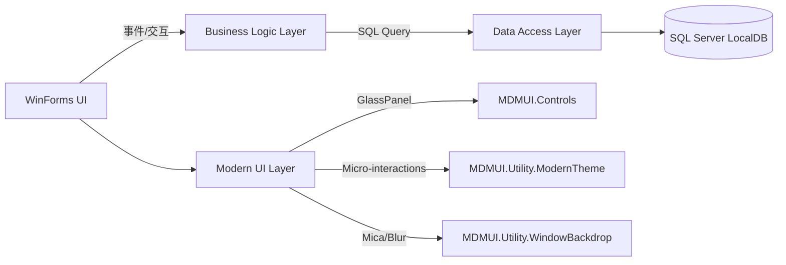

# MDMUI

```text
 __  __ ____   __  __ _   _ ___
|  \\/  |  _ \\ |  \\/  | | | |_ _|
| |\\/| | | | || |\\/| | | | || |
| |  | | |_| || |  | | |_| || |
|_|  |_|____/ |_|  |_|\\___/|___|

WinForms · .NET Framework 4.8 · SQL Server LocalDB
```

[](https://github.com/TUR1412/MDMUI/actions/workflows/build.yml)


MDMUI 是一个基于 **.NET Framework 4.8 / WinForms** 的桌面管理端示例项目，配套使用 **SQL Server LocalDB** 作为本地数据库。  
它强调“可直接跑起来”的工程体验，并在 UI 层加入了更现代的视觉语言：**Glassmorphism（玻璃拟态）** + **微交互动画**。

## ✨ 特性一览

- 🧊 Glassmorphism 登录卡片（圆角 + 半透明 + 细边框，支持子控件布局）
- 🧈 Mica / Blur 窗口背景（Windows 11 优先，Windows 10 尽力降级；失败不影响主流程）
- 🧠 hover / click 的平滑过渡动画（微交互更“丝滑”）
- 🧰 内置构建脚本 + GitHub Actions（`windows-latest`）
- 🗃️ 启动时进行“非破坏性”数据库引导（缺库/缺表创建最小可运行结构，不覆盖已有数据）

## 🧭 架构（Mermaid）



## 🚀 快速开始

### 1) 环境要求

- Windows 10/11
- .NET Framework 4.8（运行时）
- 构建工具（二选一）：
  - Visual Studio 2022（包含 .NET 桌面开发），或
  - .NET SDK（建议 8.x / 9.x 均可）
- SQL Server LocalDB：实例名默认 `MSSQLLocalDB`

### 2) 构建

仓库根目录执行：

```powershell
dotnet build .\MDMUI\MDMUI.sln -c Release
```

或使用项目内置脚本：

```powershell
pwsh -NoLogo -File .\scripts\build.ps1 -Configuration Release
```

生成产物默认在：
- `MDMUI/bin/Release/MDMUI.exe`

### 3) 数据库与初始化

默认连接字符串位于：`MDMUI/App.config` 的 `DefaultConnection`。

也支持通过环境变量覆盖（便于 CI/部署，不需要改配置文件）：

```powershell
$env:MDMUI_CONNECTIONSTRING = "Data Source=(LocalDB)\\MSSQLLocalDB;Initial Catalog=UserDB;Integrated Security=True"
```

应用启动时会自动：
- 如果 `UserDB` 不存在：尝试创建数据库
- 如果核心表不存在：创建最小可运行表结构（如 `Users/Roles/Factory/UserFactory/Permissions/UserPermissions`）
- 写入必要的基础数据（幂等、不会覆盖已有数据）

如果你需要完整演示数据与更多表结构，可在数据库中执行：
- `MDMUI/dbo.sql`

### 4) 默认账号（首次初始化时）

- 用户名：`admin`
- 密码：`1`

建议首次登录后立即修改默认密码。

## 📂 目录速览

- `MDMUI/Forms/`：WinForms 界面
- `MDMUI/Controls/`：自定义控件（包含 GlassPanel）
- `MDMUI/BLL/`：业务逻辑层
- `MDMUI/DAL/`：数据访问层
- `MDMUI/Model/`：模型
- `MDMUI/Utility/`：通用工具（包含 WindowBackdrop / ModernTheme）
- `scripts/`：构建与清理脚本
