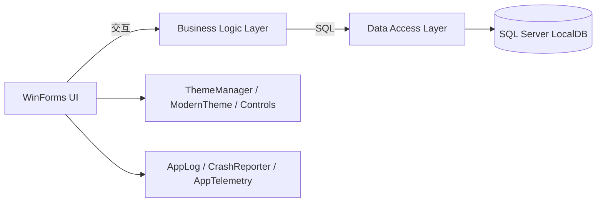

# MDMUI

```text
 __  __ ____   __  __ _   _ ___
|  \/  |  _ \ |  \/  | | | |_ _|
| |\/| | | | || |\/| | | | || |
| |  | | |_| || |  | | |_| || |
|_|  |_|____/ |_|  |_|\___/|___|
WinForms · .NET Framework 4.8 · SQL Server LocalDB
```

[](https://github.com/TUR1412/MDMUI/actions/workflows/build.yml)


MDMUI 是一个可直接运行的 WinForms 管理端示例项目，强调：
- 清晰分层（UI / BLL / DAL）
- 可配置策略（安全、备份、主题等）
- 可观测性与可诊断性（日志、崩溃报告、性能埋点）
- 增量式 UI 设计系统（Atomic Design：Atoms / Molecules）

> 说明：本项目为 WinForms 桌面应用，Web 领域的 Lighthouse 评分不适用；性能与体验目标通过启动/关键路径埋点、控件双缓冲与交互优化来衡量与迭代。

---

## 目录

- [功能与模块](#功能与模块)
- [架构概览](#架构概览)
- [快速开始](#快速开始)
- [配置与参数](#配置与参数)
- [日志与诊断](#日志与诊断)
- [UI 设计系统（Atomic Design）](#ui-设计系统atomic-design)
- [CI](#ci)
- [English](#english)

---

## 功能与模块

- 登录安全：失败计数、锁定策略、密码策略、权限校验
- 系统参数中心：集中管理安全/备份/主题策略
- 数据备份中心：一键备份、保留策略自动清理旧文件
- 命令面板（Command Palette）：最近/常用优先，支持固定常用功能
- 统一主题系统：颜色、字体、控件风格统一应用
- 崩溃兜底：未处理异常弹出崩溃报告窗，可复制详情/打开日志目录
- 日志与埋点：
  - AppLog：落盘日志（按天 + 大小轮转 + 保留策略）
  - AppTelemetry：轻量性能埋点（关键路径耗时记录）
  - AuditTrail：关键操作审计（SystemLog）
- 单元测试：MSTest + GitHub Actions 中执行 `dotnet test`

---

## 架构概览



设计原则：
- 业务逻辑尽量收敛在 BLL / DAL，UI 负责交互与状态呈现。
- 增量升级遵循开闭原则（Open/Closed Principle）：尽量以新增模块/控件扩展能力，仅在必要接入点做小改动。

---

## 快速开始

### 环境要求

- Windows 10/11
- .NET Framework 4.8（运行时）
- Visual Studio 2022（.NET 桌面开发工作负载）
- SQL Server LocalDB（默认实例 `MSSQLLocalDB`）

### 构建

```powershell
dotnet build .\MDMUI\MDMUI.sln -c Release
```

或使用脚本：

```powershell
pwsh -File .\scripts\build.ps1 -Configuration Release
```

### 测试

```powershell
pwsh -File .\scripts\test.ps1 -Configuration Release
```

### 数据库

- 默认连接字符串：`MDMUI/App.config` -> `DefaultConnection`
- 可通过环境变量覆盖：

```powershell
$env:MDMUI_CONNECTIONSTRING = "Data Source=(LocalDB)\\MSSQLLocalDB;Initial Catalog=UserDB;Integrated Security=True"
```

应用启动会进行最小可运行初始化（不会覆盖已有数据）。如需完整演示数据，可执行：
- `MDMUI/dbo.sql`

### 默认账号

- 用户名：`admin`
- 密码：`1`

---

## 配置与参数

系统参数页面支持统一管理策略，例如：
- `Security.MaxFailedLogin`
- `Security.LockoutMinutes`
- `Backup.RetentionDays`
- `Backup.Directory`
- `UI.AccentColor`

---

## 日志与诊断

### AppLog（落盘日志）

- 默认日志目录：`%LOCALAPPDATA%\MDMUI\logs`
- 默认日志文件：`mdmui-YYYYMMDD.log`（按天）
- 大文件轮转：单文件超过阈值会自动轮转到 `mdmui-YYYYMMDD-HHmmss-PID.log`

支持覆盖（环境变量优先于 `App.config`）：
- `MDMUI_LOG_DIR` / `MDMUI.LogDirectory`
- `MDMUI_LOG_MAX_MB` / `MDMUI.LogMaxMB`
- `MDMUI_LOG_RETENTION_DAYS` / `MDMUI.LogRetentionDays`
- `MDMUI_LOG_DISABLED` / `MDMUI.LogDisabled`

### 日志查看器（应用内）

在 `系统设置` 中提供：
- `打开日志目录`：直接打开日志文件夹
- `日志查看器`：在应用内查看日志文件、过滤关键字、复制内容、外部打开文件

### CrashReporter（未处理异常兜底）

未处理异常会弹出崩溃报告窗，支持：
- 复制异常详情
- 打开日志目录（便于定位问题）

### AppTelemetry（轻量性能埋点）

关键路径采用 `using (AppTelemetry.Measure("..."))` 记录耗时，并写入日志（前缀 `[perf]`）。

---

## UI 设计系统（Atomic Design）

项目以增量方式引入 Atomic Design：

- Atoms（原子）
  - `MDMUI.Controls.Atoms.AppButton`：语义化按钮（Primary / Secondary / Danger）
  - `MDMUI.Controls.Atoms.CardPanel`：卡片容器（圆角、边框、抗锯齿）
- Molecules（分子）
  - `MDMUI.Controls.Molecules.ActionToolbar`：左侧输入区 + 右侧操作区的通用工具栏布局

主题与交互：
- `ThemeManager.ApplyTo(control)`：统一应用颜色/字体/控件风格
- `ModernTheme.EnableMicroInteractions(control)`：按钮 hover/press 的轻量动效
- `IThemeSelfStyled`：自定义控件可实现该接口以避免被 ThemeManager 覆盖关键样式（遵循开闭原则）

---

## CI

GitHub Actions 工作流：`.github/workflows/build.yml`

- `msbuild /restore` 构建 `MDMUI.sln`
- `dotnet test` 运行 `MDMUI.Tests`

---

## English

MDMUI is a runnable WinForms management demo focusing on:
- Clean layering (UI / BLL / DAL)
- Configurable policies (security, backup, theme)
- Observability (file logging, crash reporting, lightweight performance telemetry)
- Incremental UI design system (Atomic Design: Atoms / Molecules)

Note: This is a WinForms desktop app; Lighthouse (web) scores do not apply. Performance targets are tracked via internal telemetry logs and UI responsiveness improvements.

### Build

```powershell
dotnet build .\MDMUI\MDMUI.sln -c Release
```

### Test

```powershell
pwsh -File .\scripts\test.ps1 -Configuration Release
```

### Logging

- Default log dir: `%LOCALAPPDATA%\MDMUI\logs`
- Daily log file: `mdmui-YYYYMMDD.log` (with size-based rotation)
- Overrides: environment variables > `App.config` (`MDMUI_LOG_DIR`, `MDMUI_LOG_MAX_MB`, `MDMUI_LOG_RETENTION_DAYS`, `MDMUI_LOG_DISABLED`)

### In-app Log Viewer

Under `System Settings`:
- `Open Log Folder` to open the directory
- `Log Viewer` to view, filter, copy, and open log files inside the app
