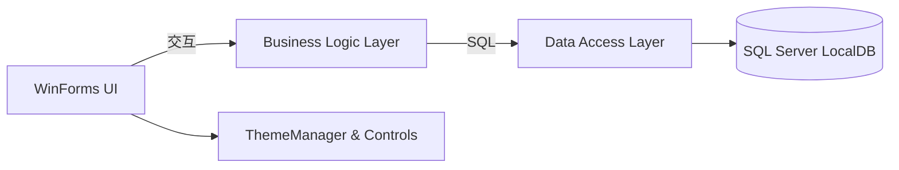

# MDMUI

```text
 __  __ ____   __  __ _   _ ___
|  \\/  |  _ \\ |  \\/  | | | |_ _|
| |\\/| | | | || |\\/| | | | || |
| |  | | |_| || |  | | |_| || |
|_|  |_|____/ |_|  |_|\\___/|___|
WinForms · .NET Framework 4.8 · SQL Server LocalDB
```

[](https://github.com/TUR1412/MDMUI/actions/workflows/build.yml)


> 中文：一个可直接运行的 WinForms 管理端示例，强调现代视觉 + 清晰分层 + 可配置策略。
> English: A runnable WinForms management demo focusing on modern visuals, clean layering, and configurable policies.

---

## ✨ 功能亮点 | Highlights

- 🔐 登录安全：失败计数 + 锁定策略 + 密码策略
- ⚙️ 系统参数中心：安全/备份/UI 均可配置
- 🗃️ 数据备份中心：一键备份 + 保留策略
- ⌨️ 命令面板智能排序：最近/常用优先，支持 Ctrl+P 固定
- 🧊 未来感主题系统：统一色彩、字体与控件风格
- 🧾 操作审计：关键操作写入 SystemLog

---

## 🧭 架构 | Architecture



---

## 🚀 快速开始 | Quick Start

### 1) 环境要求 | Requirements
- Windows 10/11
- .NET Framework 4.8（运行时）
- Visual Studio 2022（.NET 桌面开发）或 .NET SDK 8/9
- SQL Server LocalDB（默认实例 `MSSQLLocalDB`）

### 2) 构建 | Build

```powershell
dotnet build .\MDMUI\MDMUI.sln -c Release
```

或使用脚本：

```powershell
pwsh -File .\scripts\build.ps1 -Configuration Release
```

### 3) 数据库初始化 | Database
- 默认连接字符串在 `MDMUI/App.config` -> `DefaultConnection`
- 可用环境变量覆盖：

```powershell
$env:MDMUI_CONNECTIONSTRING = "Data Source=(LocalDB)\\MSSQLLocalDB;Initial Catalog=UserDB;Integrated Security=True"
```

应用启动会自动创建最小可运行结构（不覆盖已有数据）。如需完整演示数据，可执行：
- `MDMUI/dbo.sql`

### 4) 默认账号 | Default Account
- 用户名：`admin`
- 密码：`1`

---

## ⚙️ 系统参数 | System Parameters

参数页面支持统一管理安全/备份/主题策略，例如：
- `Security.MaxFailedLogin`
- `Security.LockoutMinutes`
- `Backup.RetentionDays`
- `UI.AccentColor`

---

## 🗃️ 数据备份 | Backup

在“数据备份中心”中选择目录并执行备份，支持保留策略自动清理旧文件。

---

## ⌨️ Command Palette

- `Ctrl + K` 打开命令面板
- 支持空格分词检索
- `Ctrl + P` 固定/取消固定常用功能

---

## 📂 目录结构 | Structure

- `MDMUI/Forms/`：WinForms 界面
- `MDMUI/Controls/`：自定义控件
- `MDMUI/BLL/`：业务逻辑层
- `MDMUI/DAL/`：数据访问层
- `MDMUI/Model/`：模型
- `MDMUI/Utility/`：主题/安全/工具
- `scripts/`：构建与清理脚本

---

## 🔐 安全说明 | Security

- 登录失败触发锁定策略，可在系统参数中调整阈值与时长
- 密码策略可配置（长度/数字/大小写/特殊字符）

---

## 🌐 English Summary

MDMUI is a WinForms management demo with modern UI, a clear BLL/DAL split, configurable security policies, a backup center, and a smart command palette. It targets LocalDB for a zero-setup experience while keeping logs and parameter management consistent.
