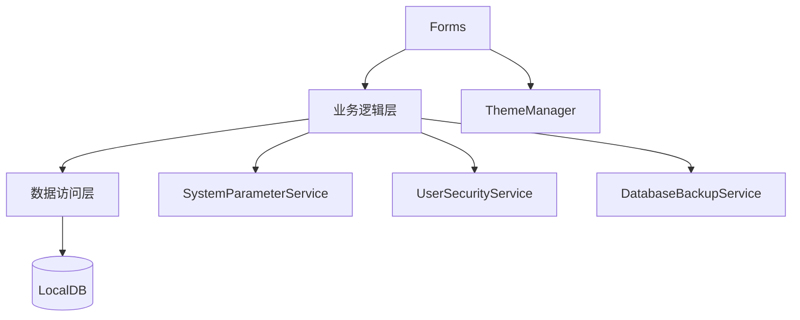

# 技术设计: MDMUI 全链路重构与功能增强

## 技术方案
### 核心技术
- C# / .NET Framework 4.8
- WinForms UI
- SQL Server LocalDB

### 实现要点
- 新增 SystemParameters / UserSecurity 表并在 DatabaseBootstrapper 中引导
- 引入 SystemParameterService + UserSecurityService 统一策略
- 新增 DatabaseBackupService 实现备份与保留
- 命令面板引入使用记录与排序打分
- 新增 ThemeManager 统一视觉风格与控件样式

## 架构设计


## 架构决策 ADR

### ADR-001: 参数中心与登录安全收敛
**上下文:** 多处参数分散，登录安全无法统一配置
**决策:** 引入 SystemParameters 表与 SystemParameterService，登录策略统一读取
**理由:** 降低硬编码，提升可配置性
**替代方案:** 在 UI 层硬编码参数 → 拒绝原因: 难维护
**影响:** BLL/DAL 新增服务与表

### ADR-002: 主题系统与命令面板统一
**上下文:** UI 风格不一致，命令面板排序不可控
**决策:** 新增 ThemeManager 与 CommandUsageStore
**理由:** 统一视觉与效率入口
**替代方案:** 分散在各窗体 → 拒绝原因: 成本高且难统一
**影响:** Forms/Utility 调整

## API设计
### 内部服务
- SystemParameterService.GetAllParameters
- UserSecurityService.TryGetLockout
- DatabaseBackupService.CreateBackup

## 数据模型
```sql
CREATE TABLE dbo.SystemParameters (
    ParamKey NVARCHAR(120) NOT NULL PRIMARY KEY,
    ParamValue NVARCHAR(2000) NULL,
    Description NVARCHAR(200) NULL,
    UpdatedAt DATETIME NOT NULL DEFAULT(GETDATE())
);

CREATE TABLE dbo.UserSecurity (
    UserId INT NOT NULL PRIMARY KEY,
    FailedCount INT NOT NULL DEFAULT(0),
    LastFailedAt DATETIME NULL,
    LockoutUntil DATETIME NULL,
    LastSuccessAt DATETIME NULL
);
```

## 安全与性能
- **安全:** 登录失败锁定、密码策略、操作日志记录
- **性能:** 参数缓存、命令面板检索评分优化、控件统一样式减少重复设置

## 测试与部署
- **测试:** 本地验证登录、菜单、参数页与备份页
- **部署:** 无新增外部依赖，按原流程构建
