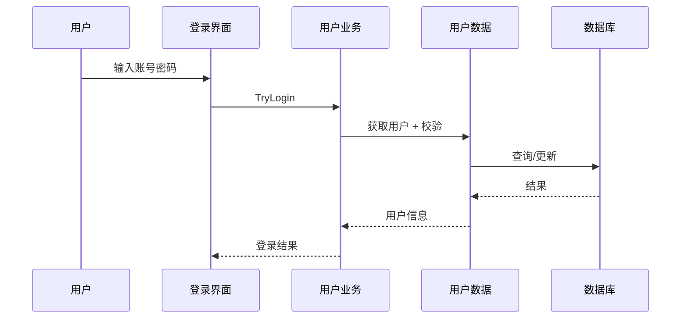

# 架构设计

## 总体架构
```mermaid
flowchart TD
    UI[WinForms UI (Forms)] --> BLL[业务逻辑层 BLL]
    BLL --> DAL[数据访问层 DAL]
    DAL --> DB[(SQL Server LocalDB)]

    UI --> Theme[主题与控件 Utility/Controls]
    BLL --> Service[参数/安全/备份服务]
```

## 技术栈
- **核心:** C# / .NET Framework 4.8
- **前端:** WinForms
- **数据:** SQL Server LocalDB

## 核心流程


## 重大架构决策
完整的 ADR 存储在各变更的 how.md 中，本章节提供索引。

| adr_id | title | date | status | affected_modules | details |
|--------|-------|------|--------|------------------|---------|
| ADR-001 | 参数中心与登录安全收敛 | 2026-01-11 | ✅已采纳 | BLL/DAL/Utility | 详见当前变更 how.md |
| ADR-002 | 主题系统与命令面板统一 | 2026-01-11 | ✅已采纳 | Forms/Utility | 详见当前变更 how.md |
